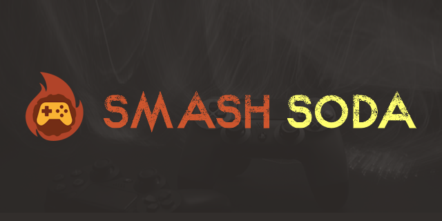
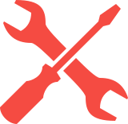

<!-- PROJECT LOGO -->
<br />
<p align="center">
  
  <h3 align="center">Smash Soda</h3>

  <p align="center">
    Unofficial Tool for Hosting on Parsec
    <br />
    <a href="https://github.com/soda-arcade/SmashSoda/releases">Latest Release</a>
    ·
    <a href="https://github.com/soda-arcade/SmashSoda/issues">Report Bug</a>
    ·
    <a href="https://github.com/soda-arcade/SmashSoda/issues">Request Feature</a>
  </p>
</p>

<!-- TABLE OF CONTENTS -->
<details open="open">
  <summary><h2 style="display: inline-block">Table of Contents</h2></summary>
  <ol>
    <li>
      <a href="#about-the-project">About The Project</a>
    <li><a href="#build-from-source-windows">Build from Source (Windows)</a></li>
    <li><a href="#build-the-documentation-mkdocs">Build the Documentation (MkDocs)</a></li>
    <li><a href="#contributing">Contributing</a></li>
    <li><a href="#license">License</a></li>
    <li><a href="#contact">Contact</a></li>
    <li><a href="#acknowledgements">Acknowledgements</a></li>
  </ol>
</details>

## About the Project

The aim of this project is to make it easier for people to host public rooms with Parsec, with lots of new features and moderation tools. It also uses an unofficial alternative to the now discontinued Parsec Arcade, called [Soda Arcade](https://soda-arcade.com).

This is a modification of <a href="https://github.com/FlavioFS/">ParsecSoda</a>, a tool developed by <a href="https://github.com/FlavioFS/">FlavioFS</a> for improving the hosting experience on Parsec Arcade. It builds upon modifications made by user <a href="https://github.com/v6ooo/">v6000</a>. Parsec Soda as of 8th August 2025 no longer works with Parsec. Due to Parsec's terms for the old software development kit SmashSoda uses, binaries cannot be distributed. You can either build SmashSoda from source yourself (instructions [HERE](https://github.com/soda-arcade/smash-soda/wiki/build-guide)) or by using the new installer script, which automates the process for you: [Installer Script](https://github.com/soda-arcade/smash-soda/releases/latest/installer.bat)

Check out the comprehensive Wiki guide on how to use Smash Soda <a href="https://github.com/soda-arcade/SmashSoda/wiki/">HERE</a>!

The Discord Server is the best place to get support quickly.

<table>
    <tr>
        <td align="center">
           <a href="https://github.com/soda-arcade/SmashSoda/releases">
               
               <div>Download</div>
           </a>
           <div>Download latest<br>version</div>
        </td>
        <td align="center">
           <a href="https://github.com/soda-arcade/SmashSoda/issues">
               
               <div>Issues</div>
           </a>
           <div>Report issues and<br>request features</div>
        </td>
        <td align="center">
           <a href="https://discord.gg/DsR9NubWYk">
               
               <div>Discord</div>
           </a>
           <div>Join the Discord<br>community!</div>
        </td>
        <td align="center">
           <a href="https://github.com/soda-arcade/SmashSoda/wiki">
               
               <div>Wiki</div>
           </a>
           <div>Read the full wiki<br>guide here!</div>
        </td>
    </tr>
</table>

## Build from Source (Windows)

You can build Smash Soda manually if you do not want to use the installer script.

### Requirements

- Git for Windows
- CMake (3.18+), available on `PATH`
- Visual Studio Build Tools with:
  - Desktop development with C++ (with ATL for x64)
  - MSVC C++ toolset
  - Windows 10/11 SDK

### Build commands

From the repository root:

```powershell
cmake -S . -B build
cmake --build build --config Release --parallel
```

Release executable:

- `x64/Release/SmashSoda.exe`

Optional debuggable build:

```powershell
cmake --build build --config RelWithDebInfo --parallel
```

Debuggable executable:

- `x64/RelWithDebInfo/SmashSoda.exe`

For the full docs version of this guide, see:
`docs/content/getting-started/manual-build.md`

## Build the Documentation (MkDocs)

From the repository root:

### Install docs dependencies

```powershell
python -m pip install mkdocs-material
```

### Run docs locally

```powershell
mkdocs serve -f docs/mkdocs.yml
```

Open `http://127.0.0.1:8000`.

### Build static docs

```powershell
mkdocs build -f docs/mkdocs.yml
```

Generated output:

- `docs/site/`

## Contributing

See the [open issues](https://github.com/soda-arcade/SmashSoda/issues) for a list of proposed features (and known issues).

Would you like to contribute to the project? That's great! Here's what you do:


1. Open a new issue reporting what you're going to do.
2. Fork this repository.
3. Create a branch for your feature.
4. Make your local changes.
5. Submit a pull request.

If you would like to donate to the project and unlock some cool extra features in the process, you can donate here: <a href="https://ko-fi.com/soda-arcade">ko-fi.com/soda-arcade</a>

## License

See `LICENSE.txt` for more information.


## Contact


Project Link: [https://github.com/soda-arcade/SmashSoda](https://github.com/soda-arcade/SmashSoda)


<!-- ACKNOWLEDGEMENTS -->
## Acknowledgements

* [MickeyUK] - [GitHub](https://github.com/mickeyuk) - SmashSoda Project Lead
* [FlavioFS] - [GitHub](https://github.com/FlavioFS/) - Original Parsec Soda Developer
* [v6000] - [GitHub](https://github.com/v6ooo/) - Developer of Parsec Soda V, which Smash Soda is a derivative of
* [unuruu5760] - [GitHub] (https://github.com/unuruu5760) - Added the Keyboard Widget
* [MonaJava] - [GitHub] (https://github.com/MonaJava) - Work on hotseat
* [8-Bit] - [GitHub] (https://github.com/8BitProtogen) - Helps with the Smash Soda wiki
* [R3DPanda] - [GitHub](https://github.com/R3DPanda1/) - Helped with some of the theme integration
