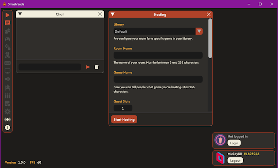

The Smash Soda interface is broken up in to widgets, which can be toggled and moved around. A widget can be moved by left click and dragging it by it's title bar. A widget can be resized by left click and dragging one of it's corners.

Analytical information about Smash Soda can be found in the bottom left corner.

Parsec and Soda Arcade account information can be found in the bottom right corner.

The vertical nav bar in the top left corner allows you to toggle the visibilty of widgets (hover over an icon to see which widget it corresponds to).